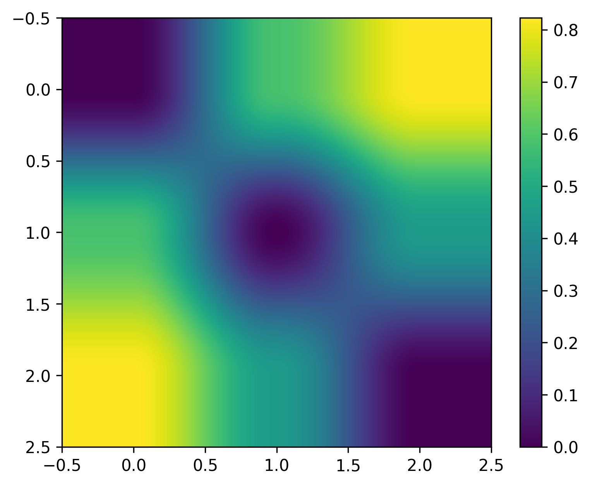
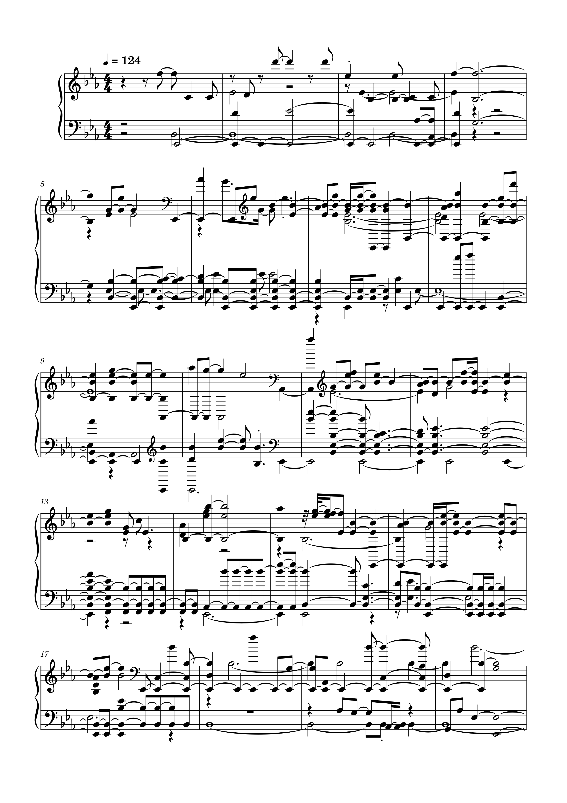
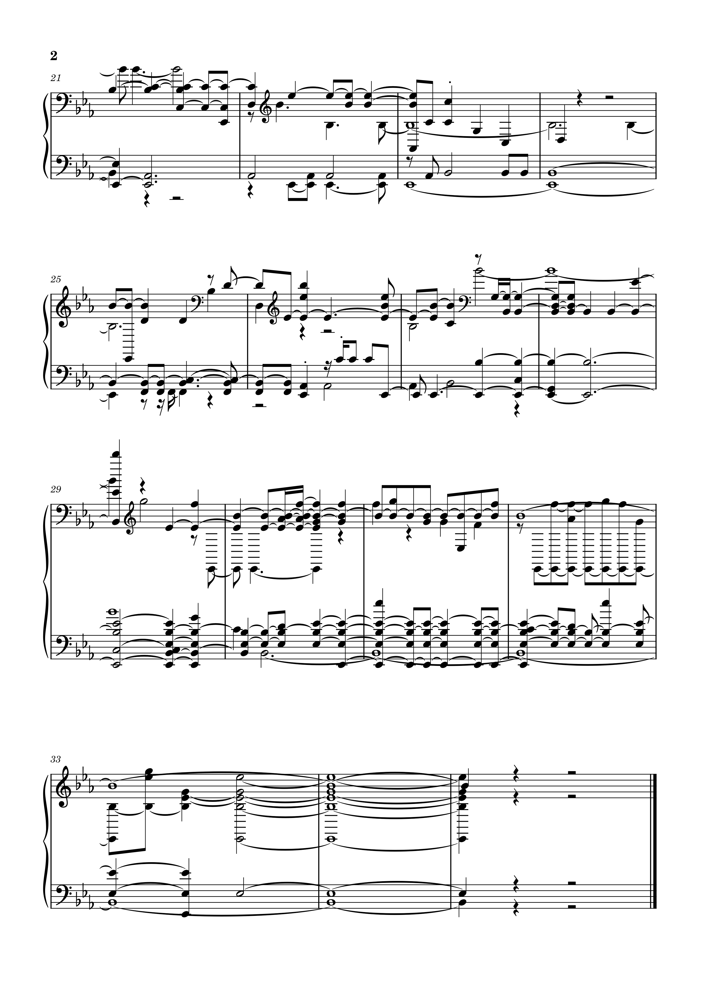

<table id="menu">
    <tr>
      <td><a href="https://carloglasgow.github.io/MCA-2025/">WEEK 1</a></td>
      <td><a href="https://carloglasgow.github.io/MCA-2025/week2.html">WEEK 2</a></td>
      <td><a href="https://carloglasgow.github.io/MCA-2025/week3.html">WEEK 3</a></td>
      <td><a href="https://carloglasgow.github.io/MCA-2025/week4.html">WEEK 4</a></td>
      <td><a href="https://carloglasgow.github.io/MCA-2025/week5.html">WEEK 5</a></td>
      <td><a href="https://carloglasgow.github.io/MCA-2025/week7.html">WEEK 7</a></td>
      <td><a href="https://carloglasgow.github.io/MCA-2025/week8.html">WEEK 8</a></td>
      <td><a href="https://carloglasgow.github.io/MCA-2025/week9.html">WEEK 9</a></td>
      <td><a href="https://carloglasgow.github.io/MCA-2025/week10.html">WEEK 10</a></td>
    </tr>
</table>

# [Week 10: Audio Similarity and Transcription]
## Task 1: Generating a Similarity Matrix

A similarity matrix compares items - like musical genres - by scoring their likeness from 0 to 1. Analyzing the provided data, inspiring uplifting indie rock and energetic indie rock would likely show a high similarity score (around 0.6–0.8) due to their shared drive and positive affect. In contrast, nostalgia-focused indie rock, with its reflective and often melancholic tone, would typically score lower (around 0.1–0.4) in similarity to the more vigorous styles, unless a track specifically merges wistful themes with an anthemic energy, creating a moderate, bridging similarity.

## Task 2: Transcription
#### Original Transcription

  
  
  
  
  

#### Redone Transciption

  
  

#### Analysis
The main difference between the original and polyphonic versions is in the piano accompaniment. The original version uses simple chords to support the melody, making it sound clear and direct. In the polyphonic version, the piano has many moving parts - now having additional melodies, fast notes, and overlapping rhythms—that all play at the same time, creating a richer, busier sound. Even with all this activity, the original melody is still easy to hear. So, while the polyphonic version sounds more complex and layered, the song underneath stays the same.
