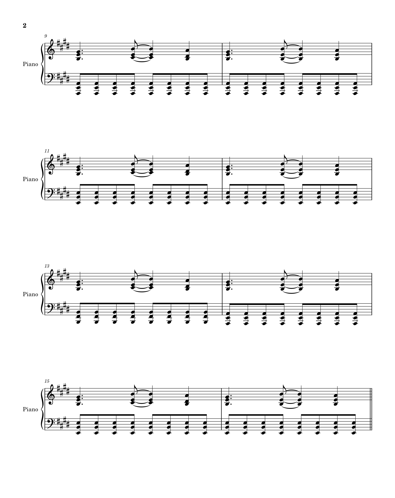
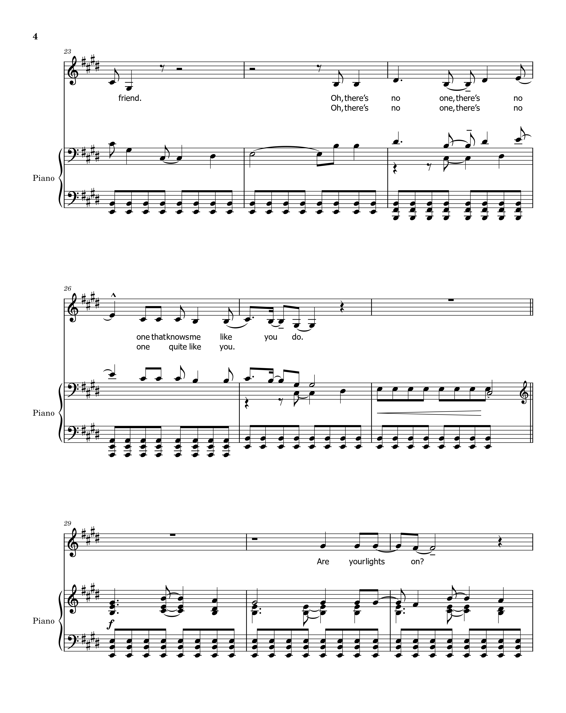
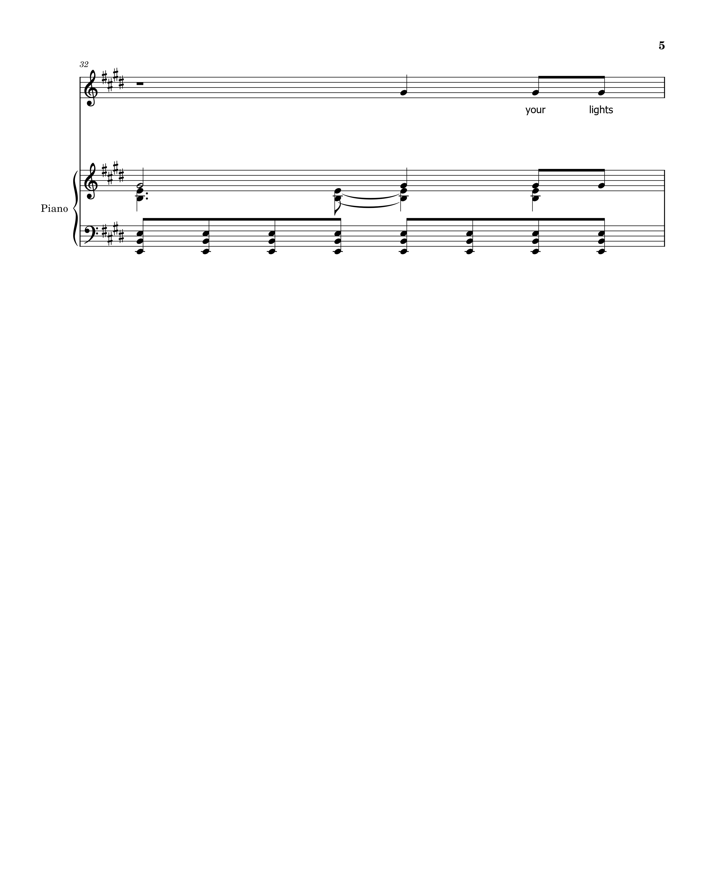

<table id="menu">
    <tr>
      <td><a href="https://carloglasgow.github.io/MCA-2025/">WEEK 1</a></td>
      <td><a href="https://carloglasgow.github.io/MCA-2025/week2.html">WEEK 2</a></td>
      <td><a href="https://carloglasgow.github.io/MCA-2025/week3.html">WEEK 3</a></td>
      <td><a href="https://carloglasgow.github.io/MCA-2025/week4.html">WEEK 4</a></td>
      <td><a href="https://carloglasgow.github.io/MCA-2025/week5.html">WEEK 5</a></td>
      <td><a href="https://carloglasgow.github.io/MCA-2025/week6.html">WEEK 7</a></td>
      <td><a href="https://carloglasgow.github.io/MCA-2025/week7.html">WEEK 8</a></td>
      <td><a href="https://carloglasgow.github.io/MCA-2025/week8.html">WEEK 9</a></td>
      <td><a href="https://carloglasgow.github.io/MCA-2025/week9.html">WEEK 10</a></td>
    </tr>
</table>

# [Week 2: Notated Music]
For this week’s task, I have decided to transcribe Wolf Alice’s song Bros. I was fortunate to find a piano and voice arrangement on Fresh Sheet Music and was able to download it - you can access it <a href = "https://freshsheetmusic.com/wolf-alice-bros-123310/" target="_blank">here</a>. Typically, the song is performed by the full band with drums, bass, and dual guitars, but the core of the piece is carried by the interlocking guitar parts and Ellie Rowsell’s vocal melody. I have used this piano and voice arrangement as the basis for my transcription, making slight adjustments to capture the harmonic texture and melodic phrasing of the original recording. Below are screenshots of a PDF version of my MuseScore file. Alternatively, you can download the file <a href="Bros.musicxml" target="_blank" download>here</a>

    
    
    
    
    

