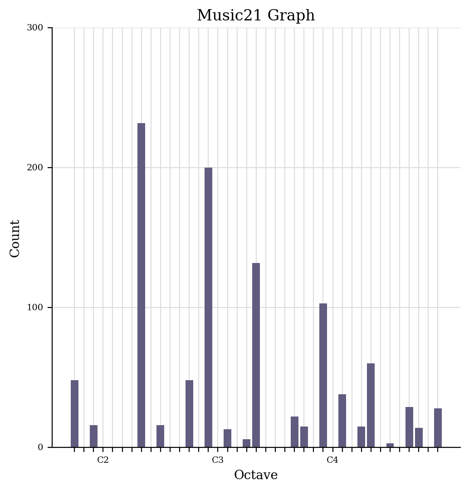
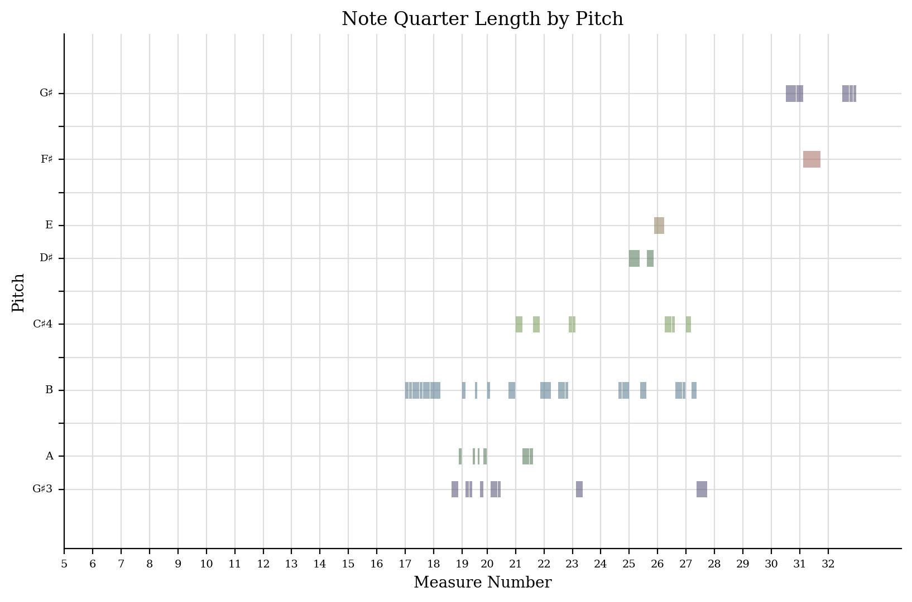
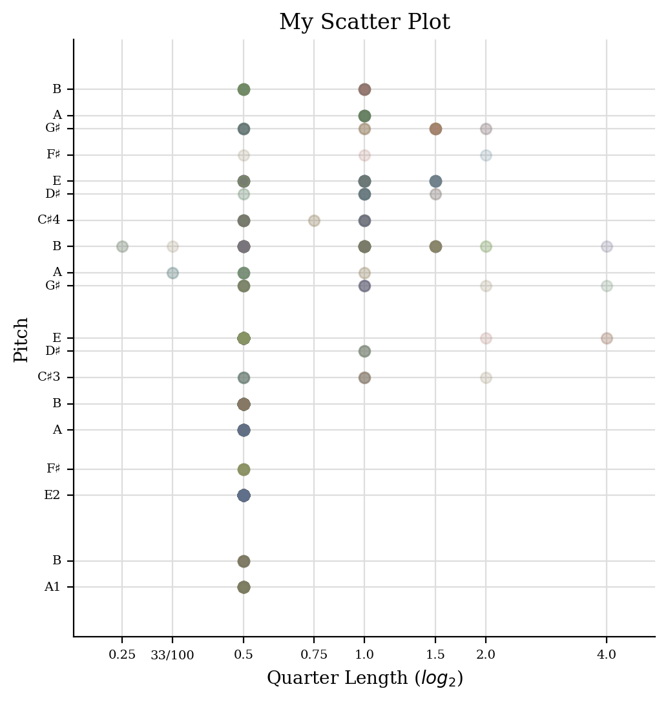

# [Week 4: Basic Analytics]
Through generating a jsymbolic of "Bros," I selected a few features:

### Melodic Structure
- Number of Pitches: 12
- Number of Pitch Classes: 10
- Range: 21 semitones
- Most Common Pitch: E4
- Most Common Pitch Class: E
- Mean Pitch: ~62
- Mean Melodic Interval: ~0.5
- Most Common Melodic Interval: 0
- Pitch Variability: Low
- Number of Common Melodic Intervals: 3

### Harmonic / Tonal Features
- Strong Tonal Centres: 1 (E major)
- Interval Between Most Prevalent Pitches: 0

### Textural & Rhythmic Features
- Repeated Notes: 0.85
- Minimum Note Duration: 0.5 beats
- Maximum Note Duration: 4 beats
- Average Note Duration: 0.75 beats
- Tempo Variability: Low

I have extracted a range of jSymbolic features that describe the melodic, harmonic, and textural qualities of the piece. These include basic attributes such as the number of pitches and pitch classes, mean pitch, and overall range, which help outline the song’s melodic contour. I have also chosen features that are particularly relevant to Bros and its nostalgic, intimate character. For instance, the piece shows low pitch variability and a high rate of repeated notes, both of which contribute to its smooth, reflective melodic style. Similarly, the most common melodic interval being unison offers insight into how the song maintains a stable, grounded texture. I also extracted features related to note duration and tempo variability, as the consistent rhythmic pacing and predominance of short to moderate note lengths help create the steady, dreamlike quality that characterises much of Wolf Alice’s early work.

## Generating a Piano Roll and a Pitch Histogram
<table>
  <tr>
    <td>
      
<strong>Pitch Histogram</strong>

      
This Music21 graph tallies notes by category (C1–C4). C2 has the most, which lines up with the repeating guitar chords in “Bros.” It shows how the harmony carries the song more than flashy melody.

    </td>
    <td>
      
    </td>
  </tr>
</table>
<table>
  <tr>
    <td>
      
<strong>Piano Roll</strong>

      
This piano roll histogram shows when and how long each note plays. You can see the verse is rhythmically busy in the mid-range, while the chorus has longer held notes like G4 and F4 which matches the sustained vocal melody in “Bros.”

    </td>
    <td>
      
    </td>
  </tr>
</table>
<table>
  <tr>
    <td>
      
<strong>Scatterplot of Pitches</strong>

      
This scatter plot compares pitch and note length. Most notes are short and melodic, but the longest ones are A and C♯—the bass and vocal sustains in “Bros.” The sharps also point to E Major, the song’s key.

    </td>
    <td>
      
    </td>
  </tr>
</table>
