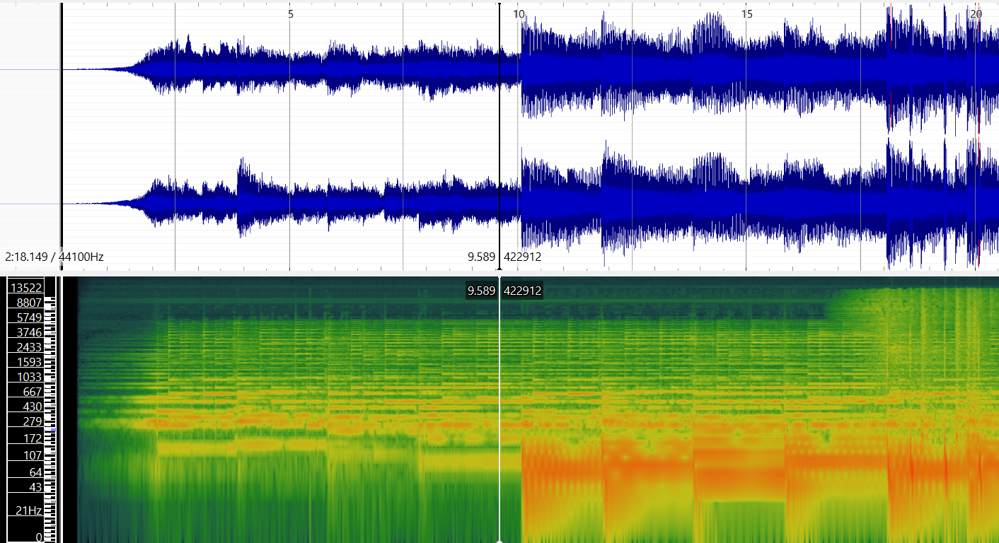
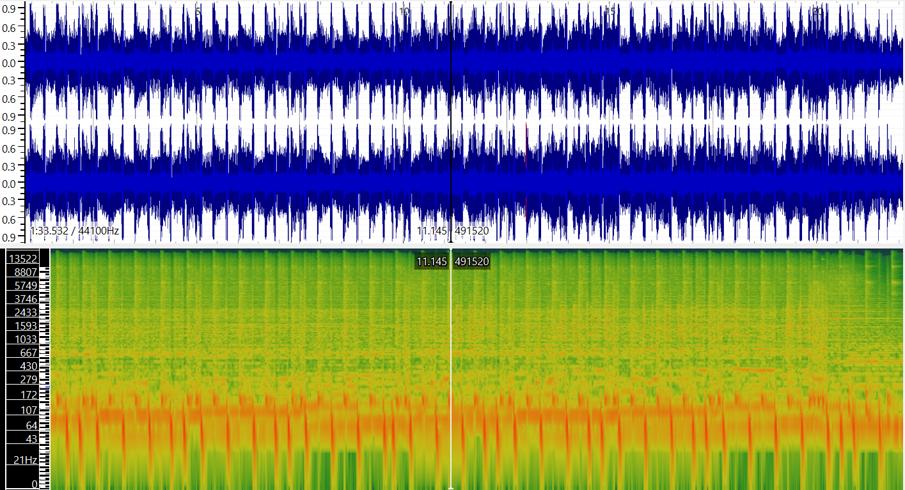
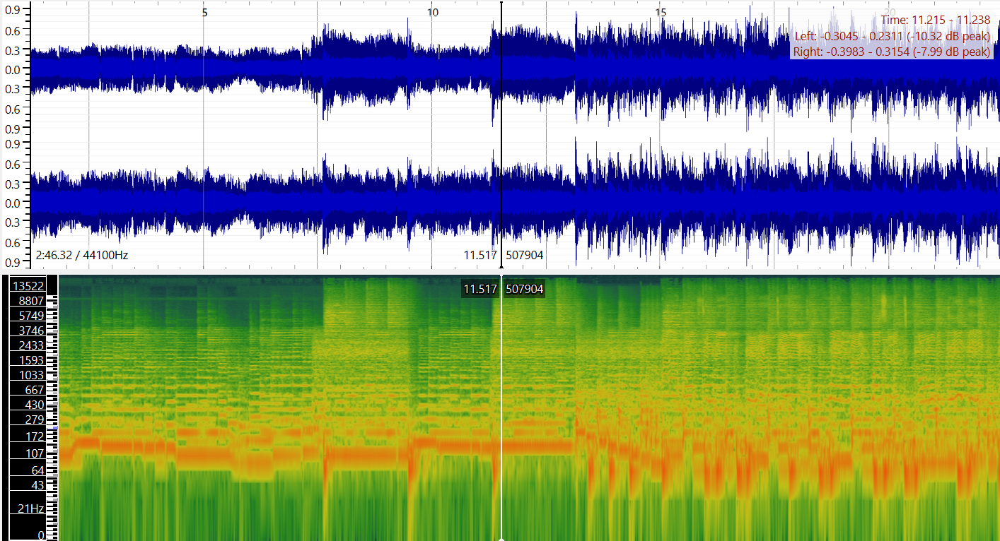

<table id="menu">
    <tr>
      <td><a href="https://carloglasgow.github.io/MCA-2025/">WEEK 1</a></td>
      <td><a href="https://carloglasgow.github.io/MCA-2025/week2.html">WEEK 2</a></td>
      <td><a href="https://carloglasgow.github.io/MCA-2025/week3.html">WEEK 3</a></td>
      <td><a href="https://carloglasgow.github.io/MCA-2025/week4.html">WEEK 4</a></td>
      <td><a href="https://carloglasgow.github.io/MCA-2025/week5.html">WEEK 5</a></td>
      <td><a href="https://carloglasgow.github.io/MCA-2025/week7.html">WEEK 7</a></td>
      <td><a href="https://carloglasgow.github.io/MCA-2025/week8.html">WEEK 8</a></td>
      <td><a href="https://carloglasgow.github.io/MCA-2025/week9.html">WEEK 9</a></td>
      <td><a href="https://carloglasgow.github.io/MCA-2025/week10.html">WEEK 10</a></td>
    </tr>
</table>

# [Week 8: Music As Sound]
## Task 1: Identifying Three Music Tracks and Listing Important Metadata About Them
 <table class="task">
 	<tr class="title"> 
 		<td> Title </td>
 		<td> Artist </td>
 		<td> Composer </td>
 		<td> Copyright Info </td>
 		<td> Genre </td>
 		<td> Source </td>
		<td> File/Audio Format</td>
		<td> Number of Channels </td>
		<td> Sample Rate </td>
		<td> Bit per Second </td>
		<td> Duration </td>
 	</tr>
 	<tr> 
 		<td class="title"> Inspiring Uplifting Indie Rock </td>
 		<td> Music for Creators </td>
 		<td> Music for Creators </td>
 		<td> CC-BY-4.0 </td>
 		<td> Rock/Indie-Rock/Instrumental </td>
 		<td> <a href="https://freemusicarchive.org/music/fretbound/single/inspiring-uplifting-indie-rock/">Free Music Archive</a></td>
 		<td> .mp3 </td>
 		<td> 2</td>
 		<td> 44100Hz </td>
 		<td> 320000bps </td>
		<td> 2:18 </td>
 	</tr>
 	<tr> 
 		<td class="title"> Energetic Indie Rock - Chorus Version </td>
 		<td> BlackTrendMusic </td>
 		<td> BlackTrendMusic </td>
 		<td> CC-BY-NC-ND-4.0 </td>
 		<td> Rock/Indie-Rock </td>
 		<td> <a href="https://freemusicarchive.org/music/blacktrendmusic/energetic-indie-rock/energetic-indie-rock-chorus-version/"> Free Music Archive </a></td>
 		<td> .mp3 </td>
 		<td> 2 </td>
 		<td> 44100Hz </td>
 		<td> 320000 </td>
		<td> 03:38 </td>
 	</tr>
 	<tr> 
 		<td class="title"> Nostalgia </td>
 		<td> The Zombie Dandies </td>
 		<td> The Zombie Dandies </td>
 		<td> CC-BY-4.0 </td>
 		<td> Rock </td>
 		<td> <a href="https://freemusicarchive.org/music/The_Zombie_Dandies/Lo-Fi_Heroes/The_Zombie_Dandies_-_Lo-Fi_Heroes_-_04_Nostalgia/"> Free Music Archive </a> </td>
 		<td> .mp3</td>
 		<td> 2 </td>
 		<td> 48000Hz </td>
 		<td> 32000 </td>
		<td> 02:12 </td>
 	</tr>
 </table>

## Task 2: Generating Spectrograms and Waveforms + Describing Advantages of Time-Frequency Analysis Over a Waveform Based One
### Task 2.1: Computing and exporting a spectrogram and waveform for each track from task 1

### Inspiring Uplifting Indie Rock - Music for Creators

### Energetic Indie Rock - BlackTrendMusic

### Nostalgia - The Zombie Dandies

## Task 2.2: Describing advantages of a time-frequency analysis over a waveform-based analysis
A key advantage of time-frequency analysis over waveform analysis is that it can visually separate different parts of the music. In a busy indie rock song, the waveform looks like one messy wavy line, mixing everything together. But the spectrogram we created can show each part clearly. For example, the strong horizontal line at 133.52 Hz and its matching higher lines show the bass or guitar note that holds steady throughout the song. At the same time, short vertical bursts under 172 Hz show the kick and snare drum hits in time with the beat. In the waveform, all these sounds are just one blended signal. The spectrogram lets us see the harmony and the rhythm separately, which makes analyzing complex music much easier.
