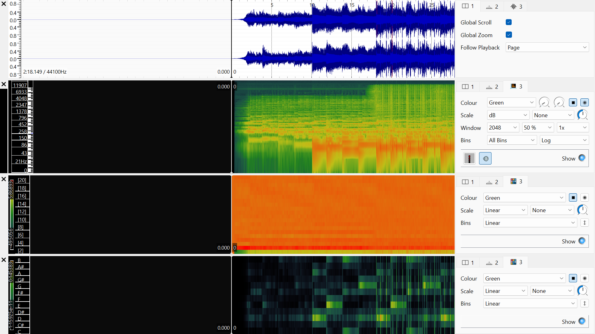
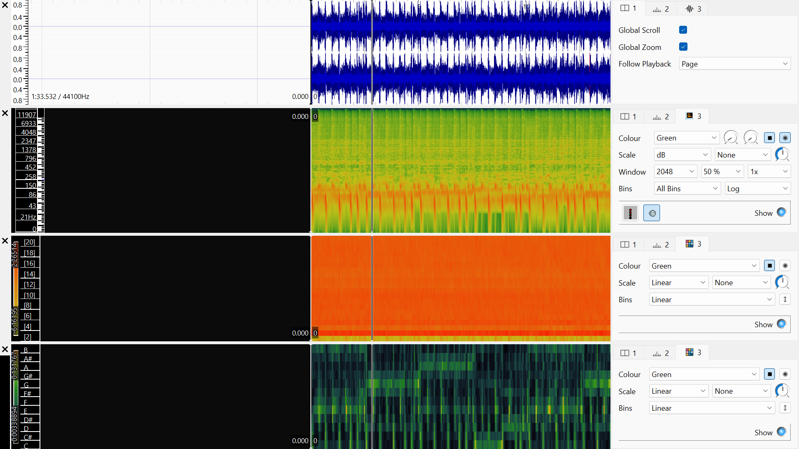
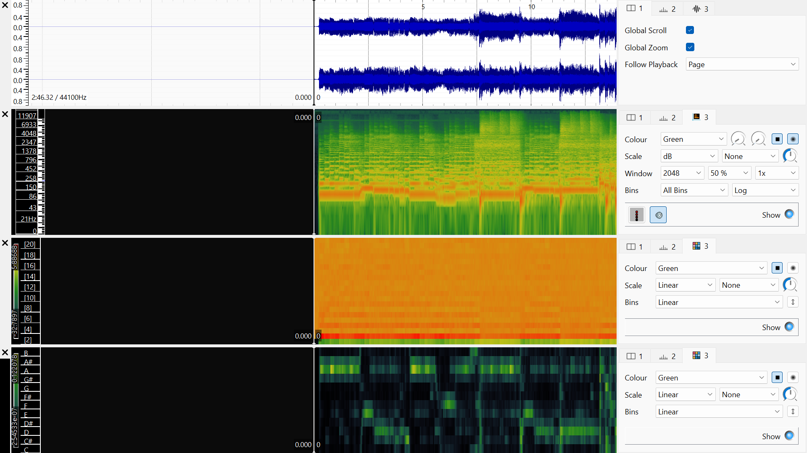
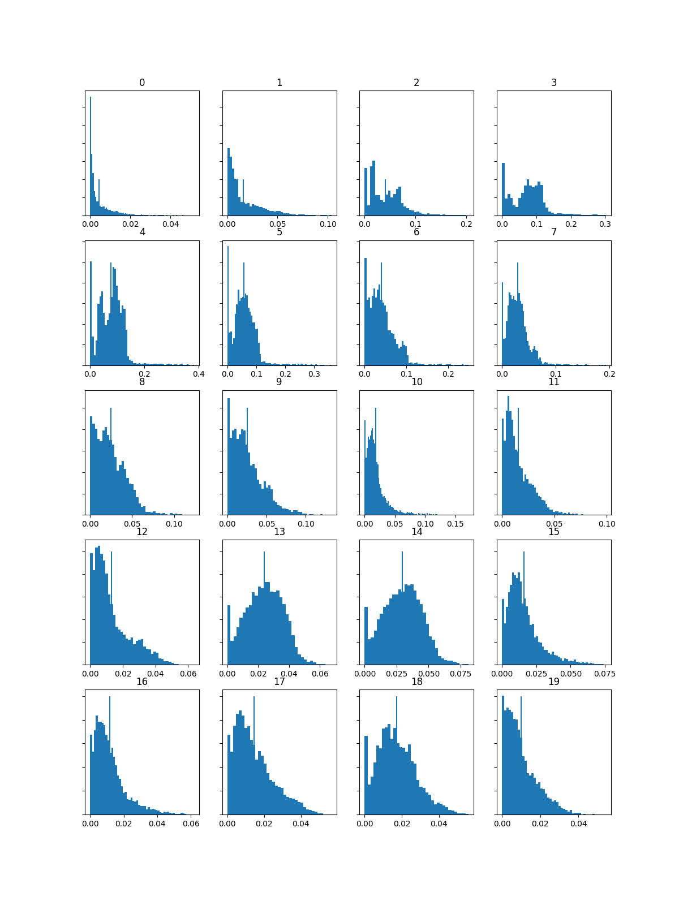
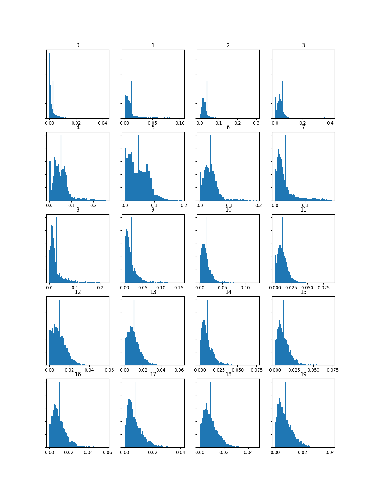
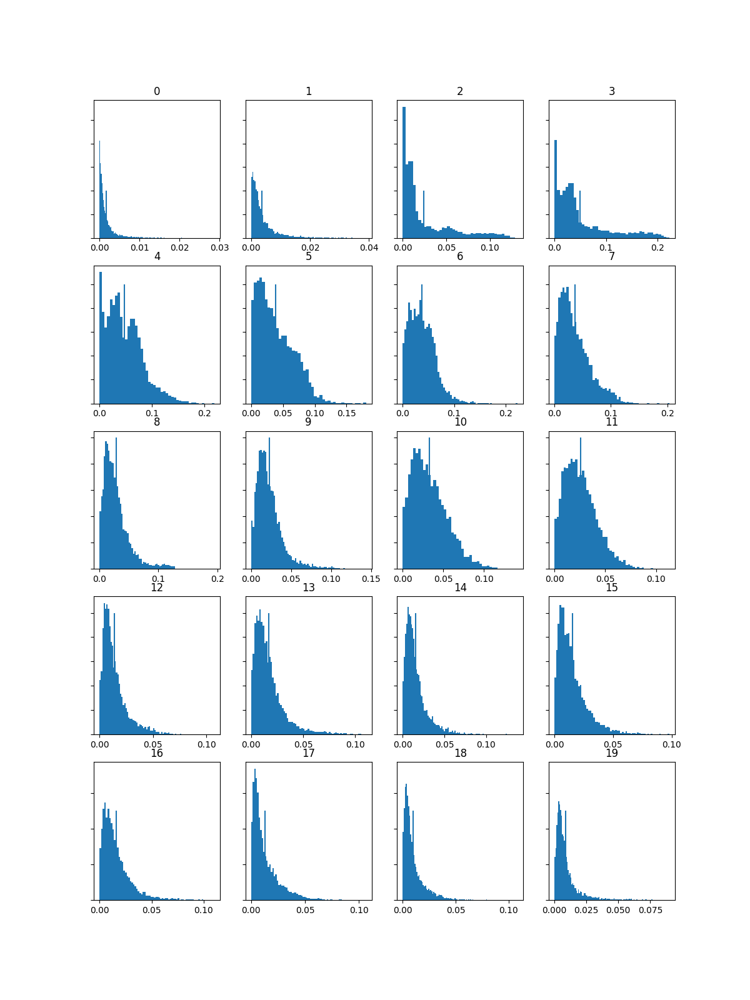
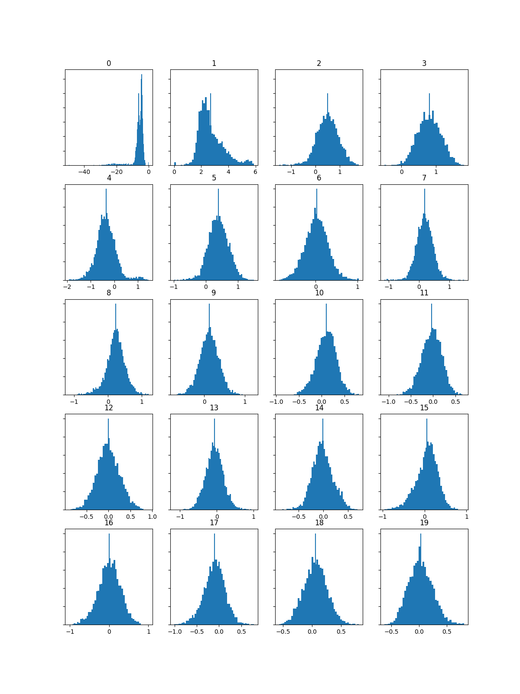
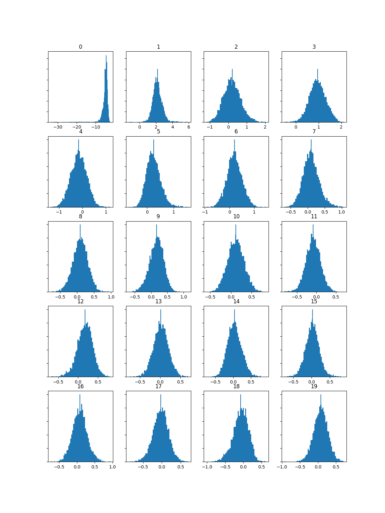

# [Week 9: Analysing and Extracting Meaning from Audio]
## Task 1: Extracting Features
  <table class="screenshots">
	  <tr> 
		  
		  
		  
	  </tr>
	  <tr> 
		  <td class="text-table"> Inspiring Uplifting Indie Rock </td>
		  <td class="text-table"> Energetic Indie Rock </td>
		  <td class="text-table"> Nostalgia </td>
	  </tr>
  </table>

  ## Task 2: Computing and visualising histograms of features
  ### Task 2.1: Computing and visualising histograms
  #### Histograms computed from spectograms
  <table class="screenshots">
	  <tr> 
		  
		  
		  
	  </tr>
	  <tr> 
		  <td class="text-table"> Inspiring Uplifting Indie Rock </td>
		  <td class="text-table"> Energetic Indie Rock </td>
		  <td class="text-table"> Nostalgia </td>
	  </tr>
  </table>
  
  #### Histograms computed from MFCCs
<table class="screenshots">
	  <tr> 
		  
		  
		  
	  </tr>
	  <tr> 
		  <td class="text-table"> Inspiring Uplifting Indie Rock </td>
		  <td class="text-table"> Energetic Indie Rock </td>
		  <td class="text-table"> Nostalgia </td>
	  </tr>
</table>

#### Histograms computed from chromagrams
<table class="screenshots">
	  <tr> 
		  
		  
		  
	  </tr>
	  <tr> 
		  <td class="text-table"> Inspiring Uplifting Indie Rock </td>
		  <td class="text-table"> Energetic Indie Rock </td>
		  <td class="text-table"> Nostalgia </td>
	  </tr>
</table>

### Task 2.2: Comparing the histograms
Based on the Chroma feature histograms, the data reveals significant and expected differences between the three tracks that align with their contrasting genres. The histogram for the track "Energetic Indie Rock" (EIR) shows a chroma distribution with more concentrated, spiky peaks—particularly in bins labeled 0, 4, and 7. This pattern is expected and reflects the song's harmonic structure: it is likely built on clear, repeated power chords or a strong tonal center (common in rock), which focuses energy on specific pitch classes like C, E, and G (if C is bin 0). In contrast, the "Nostalgia" and "Indie Pop Indie Rock" (IPIR) histograms appear smoother and more evenly distributed across several chroma bins, particularly in the IPIR plot where energy is more balanced. This suggests a less riff-driven, more harmonically varied or ambient arrangement, which matches a dreamier indie pop aesthetic with richer chord progressions. Having listened to the tracks, this difference is clearly audible. The energetic indie rock track is driven by distinct guitar chords, whereas the nostalgia and indie pop tracks rely more on lush, blended harmonies and melodic textures. The histograms successfully capture this fundamental contrast in harmonic focus and complexity, validating the Chroma feature's usefulness in distinguishing genre-based musical styles.
